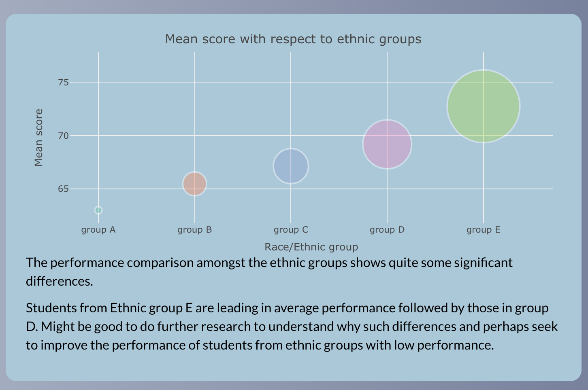

```{r setup, include=FALSE}
knitr::opts_chunk$set(echo = TRUE)
```


## Table of contents   

### 1. Introduction  
### 2. Design  
### 3. Implementation   
### 4. User guide  
### 5. Conclusion  
### 6. Bibliography  
### 7. Appendix     


\newpage  

#### Introduction  

Motivation    

Higher education is critical to an individual's future success. Predicting academic success becomes
increasingly crucial as more kids enter colleges and universities.Alyahyan and Düştegör (2020). As a
student, I have witnessed students struggle with low academic achievement owing to a variety of
causes, and by employing data exploration techniques, I am able to uncover critical aspects that
influence a student's success. In this study, I hope to analyse three of these publicly available datasets
in order to better understand the various factors that influence college students' academic
achievement. My study, I hope, will assist institutions in identifying students at risk of poor
performance and providing them with the assistance they require to achieve academically.
Furthermore, this initiative will assist education policymakers in developing effective interventions to
increase overall student performance.   

Questions we seek to address through this analysis are;       

● What are the significant factors that affect the academic performance of students?       
● Are there any significant differences in academic performance between students of different      
ethnicities or races, and if so, what factors contribute to these differences?    
● How do these factors impact the academic performance of students?     

\newpage  

#### Implementation    

##### Tech stack used in developing the dashboard   
1. R Shiny   
 - Shiny is an R package that makes it easy to build interactive web apps straight from R. 
 You can host standalone apps on a webpage or embed them in R Markdown documents or build dashboards.  
 One of the advantages of using R Shiny is that its open source, as such we don't need licence to use it. 
 
2. Cascading Styling Sheet    
 - Cascading Style Sheets is a style sheet language used for describing the presentation of a document written in a markup language such as HTML. 
 CSS is a cornerstone technology of the World Wide Web, alongside HTML and JavaScript.  

##### Packages used in developing the dashboard:  
* shiny   
  - R package for creating web applications.   
  For more, click [here](https://shiny.rstudio.com/tutorial/)    
  
* dplyr     
  - dplyr is a grammar of data manipulation, providing a consistent set of verbs that help you solve the most common data manipulation challenges.  
  For more, click [here](https://cran.r-project.org/web/packages/dplyr/vignettes/dplyr.html)    
  
* ggplot2     
  - ggplot2 is a system for declaratively creating graphics, based on The Grammar of Graphics. You provide the data, tell ggplot2 how to map variables to aesthetics, what graphical primitives to use, and it takes care of the details.   
  For more, click [here](https://ggplot2.tidyverse.org/)   
   
* plotly      
  - Create interactive web graphics from 'ggplot2' graphs and/or a custom interface to the (MIT-licensed) JavaScript library 'plotly.js' inspired by the grammar of graphics.  
  For more, click [here](https://plotly.com/r/getting-started/)   
  
* data.table       
  - For data wrangling and manipulation.  
  For more, click [here](https://cran.r-project.org/web/packages/data.table/vignettes/datatable-intro.html)    
  
  
* flexdashboard    
  - The goal of flexdashboard is to make it easy to create interactive dashboards for R. 
  Used the gauge function from this library to create gauge plot.   

* shinythemes    
  - Used to improve the overall appearance of shiny dashboards.  

\newpage 

##### Challenges   
R Shiny is not  a native web language and this paused a challenge in developing the user interface. To make the interface/theming appealing, 
I used css to alter the user interface of the R Shiny dashboard.   


#### User guide     

The dashboard has two sections:       

  * Header      
  * sidebarpanel    
  * Mainpanel     
  
##### Header  
This section of the dashboard has the title of the application which basically is meant to give an idea of what dashboard is all about.  

{width=500px height=50px} 


#### Sidebar panel  
The sidebar contains a brief about the dashboard and the analysis it shows.  


##### Main panel 
This is where we have the various graphs that give insights into the data.  

{width=500px height=200px}

\newpage 

##### Gauge plots
This kind of graphs are ideal in cases where you have some sort of target, like in this case the target score is 100. So the gauge is at the mean score and it shows what's left against the target. Perfect fit to show the average performance of boys and girls adrift the target score.  

{width=500px height=200px}

\newpage
##### Bubble plot   
This kind of plot is a good alternative to bar graphs. It fits well in cases where you want to visualize categorical data with respect to quantities. The size of the bubble corresponds to the numeric value for a given item. In this case we see the average performance per ethnic group. 
The plot brings out the comparisons well, note that the graph is interactive, the user can hover on the graph to see average score and the respective ethnic group.  

{width=500px height=200px}

\newpage 

##### Combined bar graphs  
Ggplot2 R graphing library has this amazing feature where you can have multiple bar charts faceted on a group variable. This feature was used to plot the average score for multiple variable; parents education levels, lunch, test preparation and ethnic group. This graph is a good way to combine multiple graphs into one instead of plotting them separately.   
Additionally, we have a dropdown menu that the use can use to select the view per selected subject.  
Also, the graph has a legend for guiding the user on the color used and how it relates to the various score values.    


{width=500px height=200px}

\newpage 
##### Scatter plot  
This is the go to graph whenever you want to see relationship between two variables. In this case we used the scatter plot to show the relationship between students performance in two subjects (math and reading), further, we added a color aspect to the points to show the gender comparisons. 
The relationship came out well, quite interesting to see how the graph shows the differences in performance by gender for the two subjects; boys performing well in math whereas the girls doing well in reading.   

{width=500px height=200px}

\newpage 

##### Grouped bar chart 
The grouped bar chart is a good way to show comparison for the items of a variable and how they compare in terms of quantities. 
This graph is best for comparing quantities of categorical variable items. For this case we use it show the average performance of boys and girls per subject. 
Quite interesting to see how the graph show the gender differences in performance across all subjects. Girls do well in reading and writing whereas boys do well in math.   

{width=500px height=200px}

\newpage 
##### Combined bar and line graph   
This is an amazing graph, being able to have two graphs on the same plot with different scales. This helps to see the comparisons of variables together as see how they relate if there be any kind of relationship. For this case we have the line graph showing the number of students on top of the bar graph that shows the student performance per ethnic group. This graph has a dropdown menu that is used to select subjects and have the graph show graph output for the selected subject.  

{width=500px height=200px}

##### Heatmap  
This is also a good alternative to scatter plot when you want to see relationship between two variables. The data is presented in a two dimensional panel whereby the color of the cell values shows the magnitude in the values for the two variables in comparison.  In this case we want to see if there is any relationship between going out with friends and number of hours spent studying in terms of performance.  
There is a legend that shows the color intensity in relation to the score values.   

{width=500px height=200px}

### Conclusion
From the analysis of the various variables in the dataset, it is evident that there are factors that contribute to the performance of students.  
There are significant differences in student performance based on the race/ethnicity, this might need further investigation as to why students from certain races performed better than those from other ethnic backgrounds.  
The combination of the number of hours students spend studying and them going out with friends revealed some sweet 'spots' for optimal performance, generally, the lower the going out the better the performance, for the number of hours spent studying, the more the hours the better the performance. 

#### References 

    
1. Alyahyan, E. D. (2020). Predicting academic success in higher education: Literature
review and best practices. International Journal of Educational Technology in Higher Education, 17(1),
 https://doi.org/10.1186/s41239-020-0177-7
2. Cortez, P. (2008). Student Performance Data Set. UCI Machine Learning Repository: Student
Performance Data Set. Retrieved April 23, 2023, from
https://archive.ics.uci.edu/ml/datasets/student+performance  

3. Seshapanpu, J. (2018). Students performance in exams. Kaggle. Retrieved April 23, 2023, from
https://www.kaggle.com/datasets/spscientist/students-performance-in-exams    


